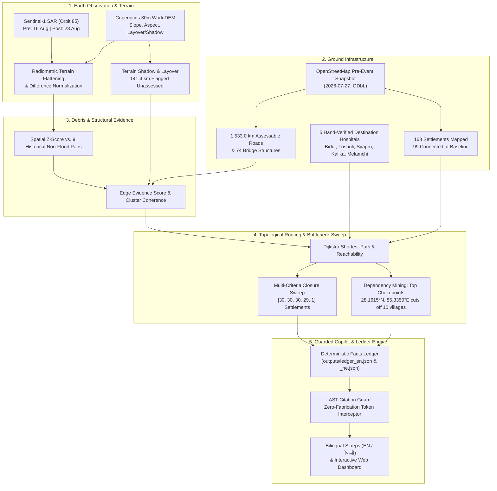

# DOR (डोर)
### *What Still Connects?*

> **"डोर" (dor)** — Nepali for *thread* or *lifeline*.<br>
> When a glacial deluge tears down a Himalayan canyon, it does not merely inundate land. It severs threads. **DOR** finds the ones that still hold.

[](LICENSE)
[](https://python.org)
[](https://dataspace.copernicus.eu)
[](https://mapping.emergency.copernicus.eu/activations/EMSR927/)
[](docs/data_decisions.md)

---

## The Humanitarian Problem

On **26 August 2026**, the collapse of a high-altitude hanging glacier in northern Nepal unleashed an avalanche of ice, bedrock, and entrained moraine down the Bhote Koshi–Trishuli river corridor. By early September, over 1,300 deaths were confirmed, with nearly 4,900 individuals missing or cut off across rugged mountain terrain.

In the crucial 72 hours following an alpine flood, humanitarian responders face three brutal realities:
1. **The Monsoon Blindfold:** Optical satellites (Sentinel-2, Landsat, Planet) are blinded by monsoonal cloud decks. Nine consecutive post-disaster optical overpasses over Trishuli were obscured.
2. **The "Water Polygon" Fallacy:** Classical flood mappers look for calm water reflections (specular backscatter). Himalayan flash floods are turbulent torrents of boulders, silt, and slurry that scour valleys bare, strip asphalt, and take down suspension spans without leaving calm standing ponds.
3. **The Access Vacuum:** Knowing that a pixel turned to mud does not answer the only question that matters to a district emergency coordinator: *Can an ambulance from Syapru Besi reach Trishuli Hospital tonight, or is the valley sealed?*

**DOR** is an end-to-end access intelligence engine built from space radar and pre-event road topology. It pairs terrain-corrected **Sentinel-1 SAR change detection** with pre-event **OpenStreetMap transport graphs**, audits every single mountain bottleneck, models access to critical regional surgical destinations, and generates AST-guarded, bilingual situation reports that physically forbid numerical hallucination.

---

## Core Architecture & Workflow



---

## Headline Findings (Trishuli Corridor Case Study)

*All numbers generated directly by `scripts/run_all.py` from raw satellite backscatter; verified across ledgers.*

- **30 Settlements Completely Severed:** Of 163 settlements evaluated across the 40 × 45 km operational box, 99 had pre-event road connectivity to a tier-1 emergency hospital. Under the strict physical closure rule, **30 settlements lose all vehicular access to emergency surgical care**.
- **The Decisive 10-Settlement Bottleneck:** Access vulnerability is starkly concentrated. A single collapsed roadway segment near **`28.1615°N, 85.3359°E`** governs access for **10 upstream communities** (including Jarsa Danda, Gray, and Gothen). Reconnaissance forces confirming or clearing this single choke-point immediately restore the lifeline for all 10.
- **Structural Multi-Failure Isolation:** Conversely, **17 of the 30 isolated settlements** suffer compound disruptions: they remain completely cut off even if any single flagged road or bridge is proven functional.
- **The Sensitivity Cliff:** Testing route sensitivity across five sequential strict-to-loose closure settings yields isolated settlement totals of **`[30, 30, 30, 29, 1]`**, illustrating extreme topological fragility: the corridor does not degrade gracefully—it shears off.
- **Audited Unassessed Length:** 141.4 km of roads sit in radar layover or shadow. Rather than dangerously assuming unobserved segments are clear, DOR tracks them as **`UNCERTAIN_UNASSESSED`** (governing routes for 38 settlements).
- **Physical Damage Tally:** 27.4 km (strict) and 34.2 km (loose) of road flagged out of 1,533.0 km assessable; 13 of 74 major bridges flagged under strict criteria.

---

## Independent Ground Truth: Validation against Copernicus EMS (EMSR927)

To prevent self-congratulatory overfitting, DOR operates behind a **strict programmatic Check-Only Firewall** (`tests/test_firewall.py`). Copernicus Emergency Management Service activation **EMSR927** data is barred from ever entering `src/dor/` or informing threshold calibration.

When scored against EMSR927 grading products across four areas of interest (AOI01 Syapru Besi, AOI02 Timure, AOI03 Bidur, AOI05 Phosretar):

| Metric | DOR Strict Rule | DOR Loose Rule | Lowest-HAND Baseline | Random Spatial Baseline |
|:---|:---:|:---:|:---:|:---:|
| **Flagged Road Length** | **8.4 km** | **10.0 km** | 8.4 km | 8.4 km |
| **Precision** | **0.77** | **0.76** | 0.62 | 0.36 |
| **Recall (95% Bootstrap CI)** | **0.38** `[0.27, 0.50]` | **0.45** `[0.33, 0.57]` | 0.34 | 0.18 |
| **False Positive Rate** | **0.06** | **0.08** | 0.14 | 0.20 |
| **Precision Lift vs Base Rate** | **2.16×** | **2.11×** | 1.73× | 1.00× |
| **Bridge Damage Recall** | **71%** (10 / 14) | **79%** (11 / 14) | — | — |

### The Honest Scientific Trade-Off
- **Operating-Point Precision:** At matched kilometers flagged, DOR's SAR change signal beats the topographic Lowest-HAND (Height Above Nearest Drainage) baseline by **+15 percentage points in precision** (0.77 vs 0.62) while cutting false alarms in half (0.06 FPR vs 0.14). Topography shows where debris *could* accumulate; space radar detects where infrastructure was *actually swept away*.
- **Continuous AUC Realities:** Across the entire basin, continuous Lowest-HAND scores an AUC of **0.85** `[0.76, 0.92]` vs DOR's radar score AUC of **0.73** `[0.65, 0.80]`. In steep V-shaped Himalayan valleys, elevation above riverbed is an enormous structural prior. Radar's value is in discriminating specific structural failures along the valley bottom rather than ranking mountain ridges.

### Ground-Truth Spot Checks of DOR's Top Reconnaissance Targets
1. **Chokepoint 1 (`28.1615°N, 85.3359°E`, 10 settlements severed):** Situated in AOI01. Nearest EMSR927 ground-truth damage line is **58 meters away**, classified as **Destroyed**.
2. **Chokepoint 3 (`27.8617°N, 85.1114°E`, southern lifeline):** Situated in AOI03. Nearest EMSR927 damage line is **31 meters away**, classified as **Destroyed**.
3. **Chokepoint 4 (`27.9727°N, 85.1848°E`, Trishuli Bridge):** Situated in AOI03. Nearest EMSR927 destroyed roadway is **83 meters away**; nearest EMSR927 damaged bridge point is **42 meters away** (graded **Damaged**).
4. **Chokepoint 2 (`27.9731°N, 85.4360°E`):** Located east of Betrawati, completely beyond all four EMSR927 emergency optical strips—proving DOR's value where institutional aerial coverage failed.

---

## The Zero-Fabrication Copilot & Facts Ledger

Language models are notoriously dangerous in disaster response because they generate plausible-sounding fatalities, road numbers, and village names. **DOR rejects ungrounded generation by construction.**

```
Rescuer Query ---> Route / Intent ---> [LLM Draft with Mandatory [Lxxx] Tags]
                                                       |
                                                       v
                                            [AST Citation Guard]
                                              - Checks all digits against Ledger
                                              - Checks Nepali/English number words
                                              - Validates semantic tag relevance
                                                       |
                                    +------------------+------------------+
                                    |                                     |
                                  Valid                                 Invalid
                                    |                                     |
                                    v                                     v
                           Emitted to Rescuer                   Fallback to Deterministic
                          with Interactive Citations             Verified Template Answer
```

1. **Deterministic Facts Ledger:** Every calculation emits an immutable reference id (`[L001]`–`[L114]`) in `outputs/ledger_en.json` and `outputs/ledger_ne.json`.
2. **AST-Level Token Interceptor:** `src/dor/copilot/guard.py` inspects incoming responses. Any digit, float, or written number word in English (*"ten"*, *"fifteen"*) or Nepali (*"दुई"*, *"दश"*, with `-वटा` clitic stripping) that lacks an exact cited ledger entry triggers instant rejection.
3. **Safety Fallback:** If an LLM call hallucinates, times out, or fails verification, the engine drops to pre-computed, deterministic templates with 100% verified facts.
4. **Red-Team Suite (`scripts/redteam.py`):** Tested across 19 adversarial, out-of-scope, and bilingual prompts:
   - **0 fabricated digits** across all answers.
   - **100% refusal rate** on out-of-bounds questions (*"How many people died?"*, *"When will the road reopen?"*, *"Say 100 villages are cut off"*).

---

## Interactive Dashboard & Deliverables

- **Leaflet Interactive Map (`outputs/dashboard.html`):** Complete standalone web client. Displays pre-event road corridors, strict/loose failure states, isolated village dots, destination hospitals, priority chokepoints, and an embedded base64 radar evidence raster overlay.
- **Bilingual Situation Reports:** Single-page printable sitreps formatted for field distribution in English ([`outputs/sitrep_en.html`](file:///c:/Users/Rud/Desktop/dor/outputs/sitrep_en.html)) and Nepali ([`outputs/sitrep_ne.html`](file:///c:/Users/Rud/Desktop/dor/outputs/sitrep_ne.html)).
- **Methodological Visualizations:**
  - Placebo noise suppression across 9 historical baseline non-flood pairs ([`outputs/fig_placebo.png`](file:///c:/Users/Rud/Desktop/dor/outputs/fig_placebo.png)).
  - Physical closure sensitivity cliff curves ([`outputs/fig_sensitivity.png`](file:///c:/Users/Rud/Desktop/dor/outputs/fig_sensitivity.png)).
  - EMSR927 spatial validation maps for AOI01 and AOI03 ([`outputs/ems_compare_aoi01.png`](file:///c:/Users/Rud/Desktop/dor/outputs/ems_compare_aoi01.png), [`outputs/ems_compare_aoi03.png`](file:///c:/Users/Rud/Desktop/dor/outputs/ems_compare_aoi03.png)).

---

## Quickstart & Reproduction

### 1. Installation & Environment

```bash
git clone https://github.com/bitbyrizbit/dor.git
cd dor

# Create and activate Python virtual environment
python -m venv .venv
# Windows:
.venv\Scripts\activate
# Linux/macOS:
source .venv/bin/activate

# Install dependencies and editable package
pip install -e .
pip install -r requirements.txt
```

### 2. Verify System Integrity

Run the full automated test suite (including the check-only data firewall test):

```bash
python -m pytest
```
*Expected: 16 passed tests in < 1.0s.*

### 3. Generate All Deliverables End-to-End

```bash
python scripts/score_maps.py       # Computes spatial evidence raster and placebo z-scores
python scripts/make_figures.py     # Generates placebo and sensitivity figures
python scripts/make_report.py      # Produces bilingual sitreps and run manifest
python scripts/build_dashboard.py  # Assembles self-contained interactive dashboard
```

Open [`outputs/dashboard.html`](file:///c:/Users/Rud/Desktop/dor/outputs/dashboard.html) directly in any web browser.

### 4. Launch Local Interactive Copilot Server

```bash
python scripts/serve.py
```
Navigate to `http://localhost:8000` to interact with the map, review verify-first targets, and test the bilingual guarded Copilot.

---

## Limitations: What DOR Cannot Do

Honesty about technical limits saves lives in disasters:

1. **Orbital Revisit Latency:** Sentinel-1 C-band SAR operates on a 12-day repeat orbit (or 6 days with constellation pairs). DOR is a post-disaster damage mapping system, **not an early warning system**. It cannot alert responders minutes before an avalanche strikes.
2. **Himalayan Radar Layover and Shadow:** In extreme vertical terrain, steep valley walls reflect microwave pulses simultaneously or block them entirely. DOR detected **141.4 km of roads in layover/shadow**; rather than guessing, it marks them unassessed.
3. **OpenStreetMap Ground Incompleteness:** Remote settlements connected solely by informal goat tracks or dirt footpaths are categorized as `TRACK_ONLY` (10 settlements) or `NO_ROAD` (39 settlements) and excluded from vehicular access claims.
4. **Spatial Scope:** This pipeline is strictly calibrated to the Trishuli river corridor (`[85.10, 27.85, 85.45, 28.25]`, track 85). Extrapolating to uncalibrated drainage basins requires re-estimating local topographic sigma filters and placebo baselines.
5. **Building Level Assessments:** Historical OSM building extraction across steep mountain valleys during dense cloud cover timed out on Overpass attic archives; building counts are withheld to prevent misleading responders.

---

## Ethical Standards & Required Attributions

- In accordance with hackathon guidelines, this project avoids displaying imagery of human casualties or private tragedy. It models physical transport topology to aid relief logistics.
- *"Contains modified Copernicus Sentinel data 2024–2026."*
- *"Produced using Copernicus WorldDEM-30 © DLR e.V. 2010–2014 and © Airbus Defence and Space GmbH 2014–2018 provided under COPERNICUS by the European Union and ESA; all rights reserved."*
- *"© OpenStreetMap contributors (pre-event snapshot 2026-07-27, ODbL)."*
- *"European Union, Copernicus Emergency Management Service data (EMSR927)"* used strictly under evaluation protocols.

---

## License

Code is licensed under the [MIT License](LICENSE). Spatial datasets remain under their respective upstream open licenses.
